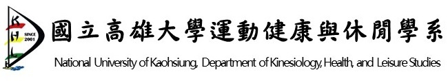

# ESWIwPP

## Motivation (動機)

近年來隨著公眾對於環境永續的重視以及對於高品質生活型態的嚮往，逐漸透過數位化與數字化(如透過”政府資料開放平臺”等資料中台)等方式關心周遭的環境。

而長久以來機器學習模型的研發與生產主要局受限於高階硬體資源與相關的軟體基礎建設的限制，以致於只有部分學術界與一部份的產業界為發展主力。但隨著AI/ML相關議題的盛行與自媒體的發酵，現今市井小民可輕易從Youtube上學得建立機器學習模型的相關知識，且日常生活中的創意問題應用(例如：如何貢獻一己之力來提升金融反詐騙模型的準確度來保護你我家人）亦可取代冰冷的教科書上的教材(萬年的Minst作業)，增加更多學習樂趣。

創意問題發想泛指日常生活中會遇到的問題，將其範圍縮小至AIML能解決的題目上，再藉由群眾之力"持續地"收集各方資料集，開發相關演算方法，訓練至具有一定效能的AIML模型，甚至到終端用戶收集驗證與評比回饋。

因此，若能將建立機器學習模型的門檻下放至全民社群參與，進而吸引更多有創意的問題發想，全民參與與改進模型方法與效能。不僅能夠提升整個AIML產業規模，亦可實現全民資料科學家之想法。

## Major Issues (主要的困難)

要達到上述的目的有幾個主要的困難得克服:

1. 越來越貴的硬體成本：現今人工智慧與機器學習蓬勃發展下，單位貨幣能買到的算力(FLOPs)大概是每兩年翻了一倍(Moore’s law)，但由於大型語言模型(Large Language Model, LLM)的顯學，使得機器學習模型的複雜度呈指數型的成長，使得社群成員(如莘莘學子或是想踏入機器學習領域的人們)所需要付出的資本成本越來越高，逐漸形成一道不容易跨過的高牆。而這道高牆在資源不足的地區型大學甚至是偏鄉地區的影響更為顯著。

2. 長期被忽略的軟體基礎建設：昂貴的硬體成本可由公有雲(如 AWS/AZURE/GCP)等平台進行租用，但長期租用下來的成本所費不貲。但如果搭配合適的軟體基礎建設，便可讓使用者在達成一樣的目標地下，透過資源共享的方式節省更多的租用成本。

3. 即時的模型回饋機制：即時的模型回饋機制特別適用於當一個問題並沒有所謂正確答案(groundtruth)時則需要透過人類行為進行主觀意識的評估(objective assessment)。即時的模型回饋機制最早應用於臉書的廣告科技(Adtech)，例如透過分拆測試(i.e. AB testing)的方式將用戶分成數個群組，用來比較不同最新消息(News Feed)的排序演算法的效能，以用戶的停留時間或互動次數來當作評估依據。而ChatGPT在官方公佈的[訓練流程](https://openai.com/blog/chatgpt)裡面也有提到透過聘請專業的寫作顧問進行不同算法間的效能評比。

## We Proposed ESWIwPP (計畫發起)

有鑑於此，我們發起了ESWIwPP(Enhancing Social Welfare Issues with Public Participation) 這個專案計畫內容，此內容意旨在於欲透過公眾參與的方式來提升社會福祉。公眾參與的方式分成底下幾種:

1. 公益需求端的參與：公益需求端可由發起人(個人或社福團體法人）進行提案，提案內容需要包含詳細需求描述，簡述有哪些可以運用的資料集以及如何進行結果驗證。
2. AI/ML 技術端的提供：AI/ML技術端可由社群人員針對單一需求貢獻模型建置演算法。
3. AI平台端的支持：平台端則由信誠金融科技(footprint-ai.com)提供必要的零成本計算資源(CPU/GPU 免費時數)以及相關的軟體服務平台（透過這個[連結申請](https://docs.google.com/forms/d/e/1FAIpQLSea4rcRBNAnBQoNk3nXPII1pmiKIK2HUS2UbGzfYwrDrbp39g/viewform?usp=sf_link)）。或亦可以使用[Google Colab](https://colab.research.google.com/?utm_source=scs-index) 等平台提供的免費資源來開發算法。我們亦歡迎其他國內平台業者一起共襄盛舉。

* 本案採用創用CC授權條款（Creative Commons License）方式，永遠提供社群免費使用。
*  上述內容提交後，隨著越來越多人了解與關心該議題，可以持續性的補充相關資料，亦可以持續性的提升與改進模型的效能。

## Possible Beneficiary (可能的受益人)

* 提出需求的公益團體可因為其需求被解決了而成為最大受益對象。
* 欲參與AI/ML學習的人士: 包含可能是在學學生或是欲轉職的社會人士，可藉由針對供給端的問題轉換成一個機器學習的演算方法，因此間接拓廣自己的技能樹。而因偏鄉地區取得高階計算資源不易，亦可利用此計畫所提供的零成本計算資源來進行學習與研讀AI/ML的相關知識。
* 私人企業: 私人企業也可以從這個專案上面的貢獻了解到單一貢獻者的程度，亦可避免紙本招募與萬年面試題目所產生的招募落差。

以環境議題為例(提案0001): AQI 空氣品質指標意旨量化空氣品質，必透過其指數(Index)來顯示該空氣品質可能帶來的危害，但現有的做法皆是以行政區域當作劃分依據，在量化指標範圍上略顯的有點粗糙。此因此若結合空氣品質觀測站與高敏感地區的地理位置(公益需求端)，而形成一個動態分割的區域來當作精細的量化指標關鍵(AI/ML技術端)，則有助於空氣品質敏感一族(最大的受益對象)了解當下區域的空氣品質與敏感地區，避免外出至該地區。

金融安全議題為例(提案0003)：金融安全議題因為後疫情時代而更顯得重視，其中「簡訊詐騙」的問題防不勝防。但若我們願貢獻一己之力來幫忙收集詐騙簡訊(公益需求端)，再透過AI/ML模型進行訓練與即時偵測(AI/ML技術端)，我們極可能可以預防詐騙集團的崛起，亦可避免你我的家人落入圈套(最大的受益對象)。

## Components  & Flow (元件與流程)

* 公眾問題託管服務：我們利用Github提供的免費資源來託管我們的群眾議題，資料與模型。而公眾議題也透過標準的貢獻原始碼的流程進行議題提交與審核。放置在Github上有另一個優點是在於可以達到影響外溢的效果，若此方式能夠普遍被其他國家沿用與共享，有助於我國的外交影響力的提升。
* AI4EDU 機器學習平台服務平台：由信誠金融科技提供的機器學習平台即服務解決方案，意旨提供社群人員零成本的計算資源(包含CPU與GPU免費時數)進行公眾議題的解題，並搭配MLOps (Machine Learning Operations)的開放原始碼解決方案Kubeflow之上，欲透過此方式讓參與的社群人員可以了解國際一流科技公司貢獻的的開源軟體架構，亦能從中學而貢獻至開源社群。
* 機器學習模型庫：模型庫泛指經由機器學習訓練後而成的模型檔案，目前欲透過Github來當作機器學習模型檔案的託管服務媒介，但因其檔案大小有其限制，後續可能會選用其他替代方案(如由信誠金融科技提供的免費AWS S3 storage儲存方案)。
* FAIG 綠色經濟下的機器學習模型推論平台: 由信誠金融科技提供的節能型機器學習模型推論平台，可透過無運算框架與微模型服務等方式能再維持一定用戶請求規模下，減少能源與計算資源的損耗。
* Chatbot模型驗證的最後一哩路:整合國人常用的通訊軟體(如LineChat)以及熟知的聊天機器人(chatbot or message API)，既可以延續現有的使用者體驗，不需要額外造輪子以外，也可以借助通訊軟體的高度黏著性讓用戶快速增長。

大致流程步驟可拆解成下面幾項：

1. 由有需求的公益團體或個人發起公眾議題提案，並透過提交拉取要求(i.e. Pull Request)發送提案內容至ESWIwPP專案。而後社群核心成員審核後方可進行合併(i.e Merge)與上架。
2. 由AI/ML技術方(社群人士 / 個人貢獻者) 提交AI4EDU零成本計算資源以及計算平台的使用與申請，該申請由信誠金融科技進行審核，審核通過之後便可以使用該資源進行模型開發以及相關的資料收集並放置公開資料儲存庫供重複使用。模型建置程式碼完成亦透過拉取要求(i.e. Pull Request)進行提交至ESWIwPP專案，由核心成員進行同儕代碼審查(Peer code review)後方可合併至專案內。通過合併的模型建置程式碼會透過由信誠金融科技所提供的Kafiedo模組，可將程式碼與資料集透過自動化模型訓練與參數優化等功能進行訓練，並將優化後的模型產出放置公開模型庫內供公眾使用，並提供具節能特性的模型服務推論解決方案。
3. 由公益團體模型使用方透過即時通訊軟體的方式使用社群建置的模型，並針對模型效能給予量化評價。該量化評價則回饋至專案內容內，提供模型開發者一個回饋機制。

## 加入我們的Chatbot ##

透過Line掃描底下QRcode加入我們的Chatbot，我們一起來讓這個世界變得更好。

## Why Us (為什麼是由我們來做)

信誠金融科技(footprint-ai.com)長期關注與發展機器學習生態圈下的軟體基礎建設(software infrastructure)，而因近期的AI領域與發展，我們意識到幾個可能的社會現象:

1. 昂貴的硬體成本會逐漸淘汰掉經濟上相對弱勢的團體，讓機器學習這個詞日後變成僅能由貴族(或權貴)掌控的技術。
2. 過時的國內教育政策: 當前的國內高等教育仍將AI/ML當作是階段性任務在執行，欲以一學期的時間來涵蓋機器學習與深度學習內容。由於機器學習與深度學習的發展速度飛快，如2012年因ImageNet比賽崛起的SuperVision 團隊引發國際的深度學習熱潮，導致後續應用若缺乏深度學習技術則不容易在效能上有顯著的提升。而缺乏持續性學習的學生們，很有可能在畢業後就可能無法跟上最新業界的潮流技術導致人才斷層。

## 合作夥伴

  |   |  | 
:-------------------------:|:-----:|:---:|:----------------:
 |  |

